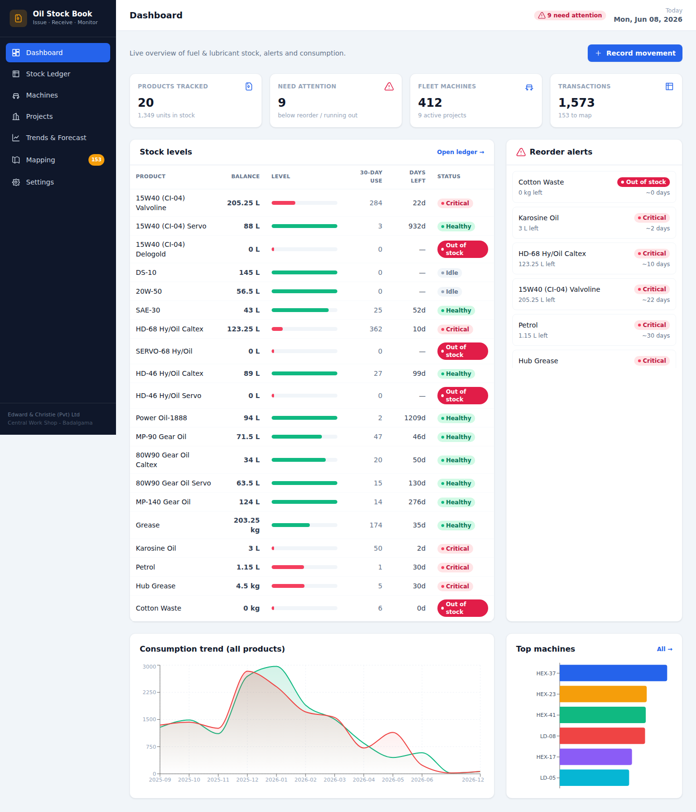
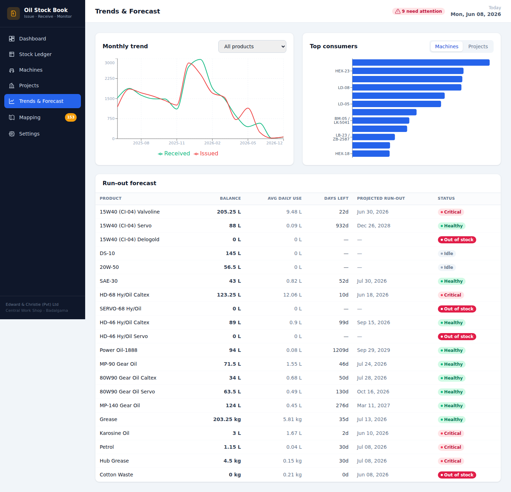
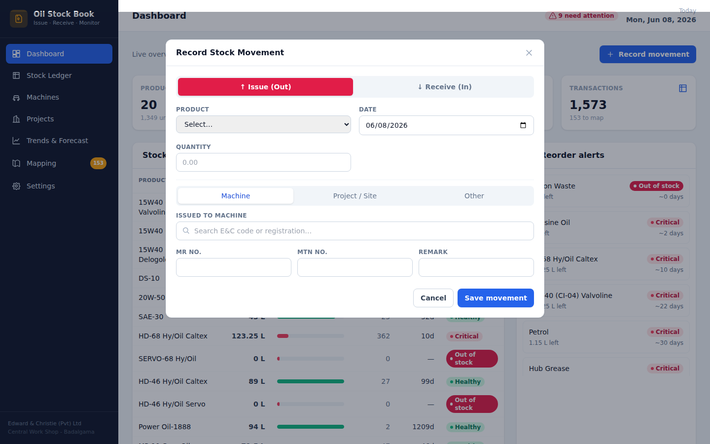

# 🛢️ Oil Stock Book — Issue / Receive Tracking & Monitoring

A self-contained web app that turns **Edward & Christie (Pvt) Ltd**'s Excel fuel &
lubricant stock book into a live system of record. Store keepers record receipts and
issues with automatic running balances; managers monitor stock levels, reorder alerts,
**per-machine** and **per-project** consumption, and run-out forecasts.

It imports the two source Excel files (the stock book and the 412-machine fleet list) on
first run, links every oil issue to the machine or project that consumed it, and
reconciles **exactly** to the original book.



---

## ✨ Features

- **Live stock ledger** — add Receipts & Issues; running balance auto-recalculated; void with one click. Each product keeps a row-for-row ledger identical to the official book.
- **Smart consumer linking** — each issue is matched to a **fleet machine** (by E&C code or registration) or a **project/site**, normalising typos and spelling variants. Unmatched entries land in a **Mapping** screen where one click links them and back-fills history.
- **Low-stock & reorder alerts** — per-product reorder levels and optional unit prices → stock valuation and a prioritised "needs attention" list.
- **Per-machine consumption** — oil used per machine with **abnormal-usage detection** (robust median + MAD vs. same-type machines) to surface likely leaks, faults or mis-entries.
- **Per-project / site consumption** — total oil (and cost, if prices are set) issued to CEP-03, Ruwanwella, Marawila, Port City, etc.
- **Trends & forecast** — monthly received-vs-issued charts, top consumers, and a projected **run-out date** per product at the current burn rate.
- **Printable stock book** — official-looking, per-product ledger with company header and signature lines (Print / Save as PDF).

### ✨ New in v2

- **Login, users & roles** — three roles: **Admin** (everything), **Store Keeper** (receive / issue / stock-take / manage products), and **Project Manager** (issues stock to their assigned projects only). Every movement records *who* made it.
- **Add any product / material** — not just oil: add new oil & lubricant brands/models, filters, spares, tyres, consumables… with category, unit, reorder level and price. Optional opening stock.
- **Issue only what is in stock** — the server refuses any issue (or edit/void) that would drive a product's book balance negative.
- **Projects & sites** — create projects from the UI and add **sites** (locations) under each; issues can be tagged to a project *and* a site.
- **Month-end stock take** — record the physical count per product, see the variance vs the book balance, and optionally post an adjustment so the book matches reality. If the previous month's count is not done within **7 days of month-end**, a **red overdue notice** appears across the app.
- **Battery register** — one battery per vehicle: vehicle number + serial number (each unique, never repeated) with a **mandatory photo** (camera capture supported on phones, auto-resized before upload). Batteries are never deleted — **transfer**, **mark-dead** and **edit** are recorded in an append-only audit history.
- **Material requisitions** — a site **requests** lubricant → the store keeper **approves & sends** (stock leaves the store here, with the over-issue check) → the **site manager confirms** the quantity received, and any shortfall is flagged as a discrepancy. Store keepers can also dispatch directly to a site for confirmation. Project managers request and confirm; they no longer move stock directly.
- **On-the-fly vehicle registration** — issuing to a machine/vehicle that isn't in the fleet yet? Add it inline from the issue form. It's saved as **pending registration**, the admin is flagged (sidebar badge + banner: "new vehicle detected — complete registration"), and the issue history carries over once the details are filled in.
- **Mobile-friendly** — responsive layout with an off-canvas sidebar; works on phones in the field.

| Trends & forecast | Record movement |
|---|---|
|  |  |

> **First login:** a default admin is seeded on first run — **username `admin`, password `admin123`**. Change it immediately in **Settings → Change my password**, and add your real users under **Users**.

---

## 🚀 Quick start

Requires **Node.js 18+** (tested on Node 22).

```bash
npm run setup     # installs server + client deps and builds the web UI
npm start         # starts the app on http://localhost:3000
```

On first start, an empty database is **auto-seeded** from the Excel files in
`data/source/`, so the app opens fully populated.

### Development (hot reload)

```bash
npm run dev       # API (3000) + Vite dev server (5173) with /api proxy
```

### Re-import the Excel data

```bash
npm run import            # idempotent — never duplicates, keeps manual entries
npm run import -- --fresh # wipe and re-import from scratch
```

---

## 🧱 Tech stack

- **Backend** — Node.js + Express + [`better-sqlite3`](https://github.com/WiseLibs/better-sqlite3) (synchronous SQLite).
- **Importer** — [`xlsx`](https://sheetjs.com) (SheetJS).
- **Frontend** — Vite + React + Tailwind CSS + [Recharts](https://recharts.org), built to static and served by Express (one process, one port).
- **Database** — a single SQLite file at `data/oilbook.db`.

---

## 📁 Project structure

```
oil-stock-book/
├── data/source/        # the two source .xlsx (used to seed the DB)
├── scripts/
│   ├── import.js       # ETL: parse sheets, classify consumers, reconcile balances
│   └── lib.js          # shared normalise() / date parsing / classification rules
├── server/
│   ├── index.js        # Express bootstrap, auth gate, static serving, first-run auto-import
│   ├── db.js           # SQLite connection + schema + lightweight migrations + settings
│   ├── schema.sql      # data model (products, txns, projects, sites, users, batteries, stock_counts…)
│   ├── auth.js         # scrypt hashing, sessions, role middleware, admin seed
│   ├── uploads.js      # base64 image → disk helper (battery photos)
│   ├── ledger.js       # recomputeLedger() — single source of truth for balances
│   ├── util.js         # consumer classification + query helpers
│   └── routes/         # auth, users, products, transactions, assets, projects,
│                       #   batteries, tally, analytics, aliases, settings
└── client/             # Vite + React app (pages/ + components/, with auth context)
```

---

## 🔌 API overview (`/api`)

| Area | Endpoints |
|---|---|
| Auth | `POST /auth/login`, `POST /auth/logout`, `GET /auth/me`, `POST /auth/password` |
| Users *(admin)* | `GET /users`, `POST /users`, `PATCH /users/:id`, `DELETE /users/:id` |
| Products | `GET /products`, `POST /products`, `GET /products/:id`, `PATCH /products/:id`, `GET /products/:id/ledger` |
| Transactions | `GET /transactions`, `POST /transactions`, `PATCH /transactions/:id`, `POST /transactions/:id/void` |
| Fleet | `GET /assets?search=&status=`, `GET /assets/:id`, `GET /assets/types`, `POST /assets`, `PATCH /assets/:id` |
| Projects & sites | `GET /projects`, `GET /projects/:id`, `POST /projects`, `GET /projects/:id/sites`, `POST /projects/:id/sites` |
| Batteries | `GET /batteries?search=`, `GET /batteries/history`, `POST /batteries`, `POST /batteries/:id/transfer`, `POST /batteries/:id/decommission`, `PATCH /batteries/:id` |
| Requisitions | `GET /requisitions`, `GET /requisitions/summary`, `POST /requisitions`, `POST /requisitions/:id/approve`, `/reject`, `/receive`, `/cancel` |
| Stock take | `GET /tally/status?period=YYYY-MM`, `GET /tally/overdue`, `POST /tally` |
| Monitoring | `GET /dashboard/stock`, `GET /dashboard/alerts`, `GET /forecast`, `GET /consumption/by-asset`, `GET /consumption/by-project`, `GET /trends/monthly`, `GET /trends/top-consumers` |
| Mapping | `GET /aliases`, `POST /aliases/:id/resolve` |
| Settings | `GET /settings`, `PUT /settings` |

All endpoints except `POST /auth/login` and `GET /api/health` require a session token
(`Authorization: Bearer <token>`); some are further restricted by role.

---

## 📊 Data fidelity

The importer treats the spreadsheet's **Balance** column as authoritative: opening
balances (`b/f`) and stock-take adjustments are captured as movements so the recomputed
running balance reproduces the book exactly. On every import a cross-check prints the
computed balance against the original "Summery" snapshot — **all 18 listed products
match to the unit.** Out-of-range dates are tolerated (flagged, never dropped).

## ⚠️ Notes

- Designed for local / office-LAN use. Logins use salted **scrypt** password hashing
  (Node's built-in `crypto`) and bearer-token sessions stored in the database — no
  external auth dependency. Battery photos live in `data/uploads/` (git-ignored, like
  the database); back these up alongside `data/oilbook.db`.
- The `xlsx` import library carries a known advisory; it only ever parses the
  organisation's own trusted files at import time, never untrusted uploads at runtime.
